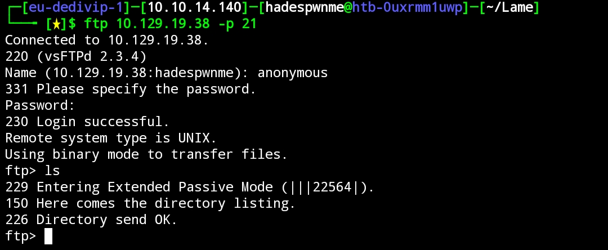
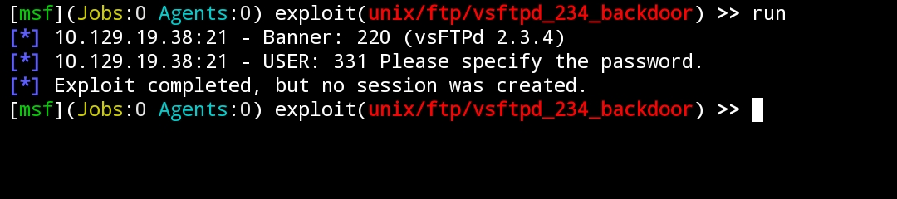
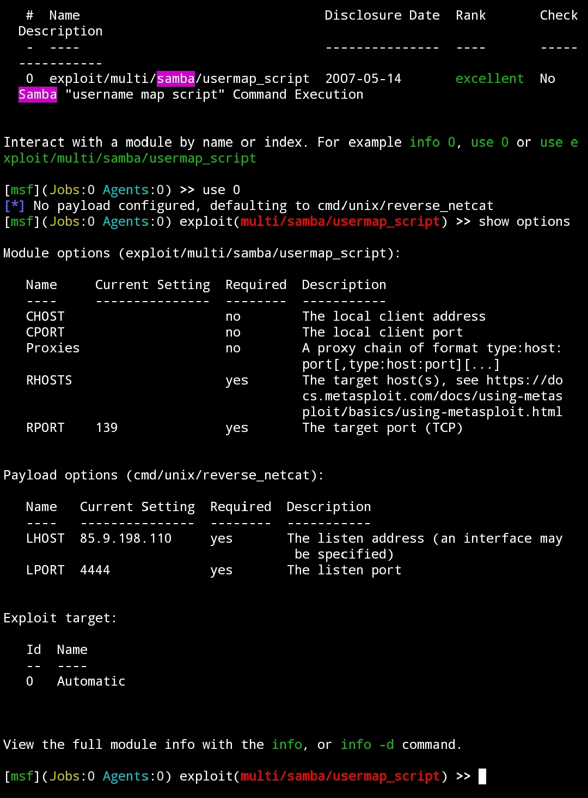
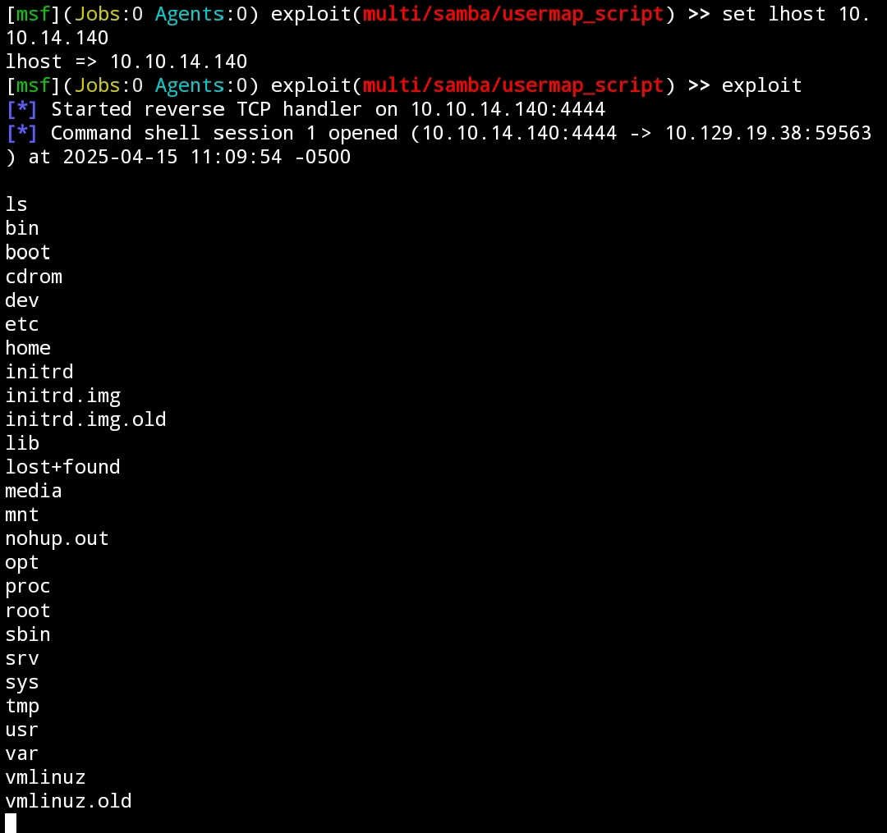
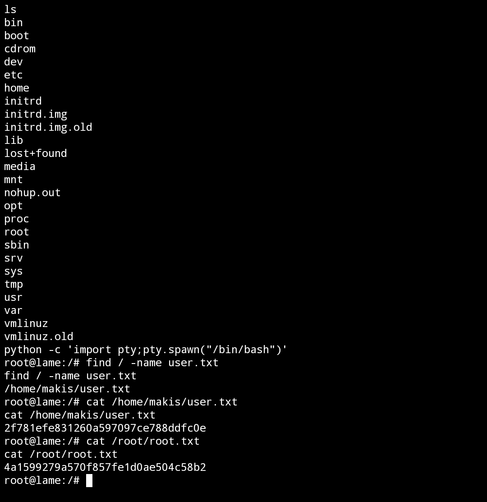

# Lame Machine


#### Nmap Enumeration
```bash
# Nmap 7.94SVN scan initiated Tue Apr 15 10:54:59 2025 as: nmap -sC -sV -T4 -oA nmap/lame 10.129.19.38
Nmap scan report for 10.129.19.38
Host is up (0.076s latency).
Not shown: 996 filtered tcp ports (no-response)
PORT    STATE SERVICE     VERSION
21/tcp  open  ftp         vsftpd 2.3.4
| ftp-syst: 
|   STAT: 
| FTP server status:
|      Connected to 10.10.14.140
|      Logged in as ftp
|      TYPE: ASCII
|      No session bandwidth limit
|      Session timeout in seconds is 300
|      Control connection is plain text
|      Data connections will be plain text
|      vsFTPd 2.3.4 - secure, fast, stable
|_End of status
|_ftp-anon: Anonymous FTP login allowed (FTP code 230)
22/tcp  open  ssh         OpenSSH 4.7p1 Debian 8ubuntu1 (protocol 2.0)
| ssh-hostkey: 
|   1024 60:0f:cf:e1:c0:5f:6a:74:d6:90:24:fa:c4:d5:6c:cd (DSA)
|_  2048 56:56:24:0f:21:1d:de:a7:2b:ae:61:b1:24:3d:e8:f3 (RSA)
139/tcp open  netbios-ssn Samba smbd 3.X - 4.X (workgroup: WORKGROUP)
445/tcp open  netbios-ssn Samba smbd 3.0.20-Debian (workgroup: WORKGROUP)
Service Info: OSs: Unix, Linux; CPE: cpe:/o:linux:linux_kernel

Host script results:
|_smb2-time: Protocol negotiation failed (SMB2)
|_clock-skew: mean: 2h00m37s, deviation: 2h49m45s, median: 35s
| smb-os-discovery: 
|   OS: Unix (Samba 3.0.20-Debian)
|   Computer name: lame
|   NetBIOS computer name: 
|   Domain name: hackthebox.gr
|   FQDN: lame.hackthebox.gr
|_  System time: 2025-04-15T11:55:56-04:00
| smb-security-mode: 
|   account_used: <blank>
|   authentication_level: user
|   challenge_response: supported
|_  message_signing: disabled (dangerous, but default)

Service detection performed. Please report any incorrect results at https://nmap.org/submit/ .
# Nmap done at Tue Apr 15 10:55:57 2025 -- 1 IP address (1 host up) scanned in 57.91 seconds
```

Dari hasil scanning nmap diatas kita bisa masuk ke ftp dengan menggunakan akun anonymous. Dan juga kita bisa memanfaatkan metasploit untuk exploit vsFTPd 2.3.4. Namun dua dua nya gagal.





Tapi disini kita bisa liat sesuatu yang menarik. **Samba smbd 3.0.20-Debian**

```bash
445/tcp open  netbios-ssn Samba smbd 3.0.20-Debian (workgroup: WORKGROUP)
```
Kita lakukan exploit menggunakan metasploit.



Kita set rhost dan lhost, lalu jalankan exploit.



#### Get Flag



Kalau kalian gabut silahkan crack password untuk root nya yang ada di folder **etc**
